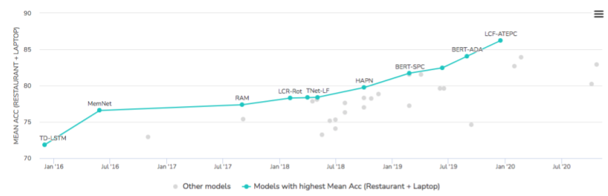
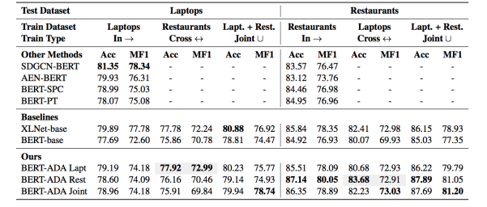
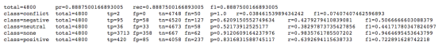
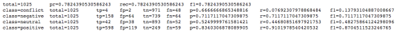

---

title: "Aspect Based Sentiment Analysis"
date: 2020-04-30T14:34:18+01:00
tags: ["bert", "ABSA", "domain adaptation"]
draft: false

---

In this post I report on [approaches to ABSA](#approaches) as a Bert Sentence Pair Classification (BERT-SPC) problem together with domain adaptation of the Bert language model (BERT-ADA). I also present my [implementation](#experiments) of both BERT-SPC and BERT-ADA.

 <!--more-->
 
# What is ABSA?

Example: “The dessert in this restaurant is good but the service is poor”.

In this review sentence, sentiments (i.e., **polarity**) are expressed towards different “**aspects**” of the domain, namely “food” with a positive polarity, and “service” with a negative polarity.


# ABSA vs TABSA 

ABSA is different from TABSA (**Target Aspect Based Sentiment Analysis**). In TABSA,  there is a target, say, a specific location, and aspect-polarity pairs associated with it. You might say: 


    “Burger King has excellent hamburgers but lousy nuggets whereas MacDonald’s has fantastic nuggets and mediocre burgers.”. 

In this sentence you have target “Burger King” associated with an aspect sequence “hamburgers” with polarity “positive”, and with an aspect sequence “nuggets” with polarity “negative”. You also have target “MacDonald’s” with positive polarity on “nuggets” and negative polarity on “burgers”.


# Two tasks

There are 2 tasks associated with ABSA:


1. Determining what are the aspects. This can be done either by detecting the aspect category, i.e., **Aspect Category Detection** (ACD), or by extracting terms related to aspects, i.e., **Aspect Term Extraction (ATE).**
2. Determining the polarity of each aspect = **Aspect Polarity Detection** (APC)

ACD can be performed with **multi-label classification** task, i.e., assigning the entire review labels such as Food, Service, etc.

ATE can be performed using **Sequence Labellin**g like in Named Entity Recognition, where the sequence of tokens under review is detected in-situ such as terms “dessert”, “service”, “nuggets”, “hamburgers”. However ATE is dependent on having an annotated dataset which is costly to build. 

Polarity can be assigned to each aspect-category or to each aspect-target aka sequence of tokens.


# Datasets


## Semeval 2014

[SEMEVAL-2014](https://alt.qcri.org/semeval2014/task4/) dataset contains short restaurant reviews where aspect term sequences are identified and assigned a polarity, as shown in the example below.


```
   <sentence id="1634">
        <text>The food is uniformly exceptional, with a very capable kitchen which will proudly whip up whatever you feel like eating, whether it's on the menu or not.</text>
        <aspectTerms>
            <aspectTerm term="food" polarity="positive" from="4" to="8"/>
            <aspectTerm term="kitchen" polarity="positive" from="55" to="62"/>
            <aspectTerm term="menu" polarity="neutral" from="141" to="145"/>
        </aspectTerms>
        <aspectCategories>
            <aspectCategory category="food" polarity="positive"/>
        </aspectCategories>
    </sentence>
```


# <a name="approaches"></a>Approaches to Polarity Detection

Approaches are summarized  by [this page](https://paperswithcode.com/sota/aspect-based-sentiment-analysis-on-semeval) on the Semeval 2014 task 4 subtask 2 (polarity detection on restaurants dataset) by this graph (as of January 2021).





Given this graph, it makes sense to investigate BERT-SPC and then BERT-ADA which is build on top of BERT-SPC. 

[LCF-ATEPC](https://arxiv.org/pdf/1912.07976.pdf) consists of Joint Learning of polarity detection and aspect term extraction with the best SOTA performance (see [github](https://github.com/ScalaConsultants/Aspect-Based-Sentiment-Analysis) project).

## BERT Sentence Pair Classification (BERT-SPC)

This approach presented in [this paper](https://www.aclweb.org/anthology/N19-1035/) (2019) consists in representing the sentence and aspect as a sentence pair, which must be classified as one of the polarity values.

So the sentence S: “The dessert in this restaurant is good but the service is poor”.
Is codified as “[CLS] S [SEP] food [SEP]” with polarity class value “positive” and “[CLS] S [SEP] service [SEP]” with polarity class  value “negative”. 

In addition all other aspects are codified in this sentence, for example “[CLS] S [SEP] price [SEP]” with polarity “none”.

Although initially counter-intuitive, given that “none” is not a polarity, it allows to gIve a value which is neither “positive”, “negative” or “neutral” when the sentence is not about any of the aspects, e.g., “I love cats”.

## Domain Adaptation with Bert Language Model Fine-Tuning (BERT-ADA)

In [this paper](https://arxiv.org/pdf/1908.11860.pdf) the authors use BERT-SPC, but in order to address the issue of small training set typical of ABSA domains, they first perform fine-tuning of the language model with a large dataset before training the ABSA classifier (github project is [here](https://github.com/deepopinion/domain-adapted-atsc)). The first fine-tuning is done on a masked word and next sentence prediction tasks and use the Amazon Reviews (1.8GB of review + 187mb of metadata) and/or the Yelp Restaurant Reviews (3.9GB of reviews). They experiment with different domains as in-domain and cross-domain training and evaluation, and with different, mainly BERT architectures.

Their results show they get better performance  when using fine-tuning on a related dataset before classification (e.g., plain BERT sentence pair ABSA).



For example, the BERT-base is the Bert Sentence Pair classification described earlier is according to the author the same as the BERT-SPC (and results are similar). When fine-tuning on Yelp Restaurants dataset, and then training the classifier on semeval 2014 restaurant reviews (so in-domain), the F-score in 80.05 and accuracy is 87.14, which is higher than BERT-base/SPC accuracy of 84.92 and F-score of 76.93.

# <a name="experiments"></a>Experiments with Polarity Detection

## Applying BERT-SPC

[This notebook](https://colab.research.google.com/drive/1bNjIzX0YCssgQN0YPIMFB_2KpqbNuLNU) implements BERT-SPC with tensorflow 2 on the Semeval 2014 Restaurant Reviews Dataset.

The results of experiment 2 (including a “none” value when the text is not about the aspect) per polarity value is the following:



Despite an overall F1 score of 89%, positive polarity has an F1 score of 72% and negative polarity has an F1 score of 51%.

The results of experiment 1 per polarity value is the following:



In this case the positive F1 score is 87% and the negative is 72.

## Applying BERT-ADA

We fine-tune the BERT language model with the [Yelp](https://www.yelp.com/dataset/download) dataset of restaurant reviews (domain adaptation) before applying BERT-SPC. 

The Bert code for fine-tuning pretrained language model is implemented for tensorflow 1. 

### Preprocessing

**Step 1:**

To extract reviews about restaurants from the Yelp review file `yelp_academic_dataset_review.json`, we filter reviews by business category Restaurant via the `yelp_academic_dataset_business.json` file. This can be done with code [here](https://github.com/nadjet/domain-adapted-atsc/blob/master/prepare_restaurant_reviews.py).

**Step 2:**

Next the restaurant reviews dataset is preprocessed using a script provided in the [github project](https://github.com/deepopinion/domain-adapted-atsc)'s page and consists in removing reviews with less than 2 sentences, to be compatible with the BERT next sentence prediction task, using spacy sentence tokenizer.
The [code](https://github.com/deepopinion/domain-adapted-atsc/blob/master/prepare_restaurant_reviews.py) provided in the github is not parallelized despite using Spacy’s n_threads property in nlp.pipe call. [Here](https://github.com/nadjet/domain-adapted-atsc/blob/master/prepare_restaurant_reviews.py) is the same code with the script parallelized.
After extracting and processing the reviews for fine-tuning we get 1,243,724 restaurant reviews consisting of 10 million sentences.
 
**Step 3:**

The dataset is sharded into smaller files of 25k lines and each file is fed to [this script](https://github.com/google-research/bert/blob/master/create_pretraining_data.py) from [Google Bert](https://github.com/google-research/bert) which creates training data for fine-tuning the language model. This file takes as input a single file, and so it must be applied on each of the sharded files, by script bulk_create_pretraining_data.py, which also runs on multiple cores.
The script creates the input, mask and segment sequences for each sentence pair, and replaces up to a maximum number tokens with “[MASK]” as the language model prediction task for fine tuning. This number, which is max_predictions_per_seq is set to be max_seq_length * mask_lm_prob, as specified in BERT documentation, which amounts to roughly 40 (256*0.15).

### Language model fine-tuning

Next, the script `run_pretraining.py` is called to fine-tune the Bert language model, with same max_seq_length (256) and max_predictions_per_seq (40) values.
 
This stage was done on AWS. The resulting model is in tensorflow 1.15. 
 
It took 1h30 to train 10k steps with max seq length = 256 and max_predictions_per_seq=40 and num_warmup_step=50 and learning rate=5e-5 and batch size=16. I get:

```
loss = 2.230954
masked_lm_accuracy = 0.60585546
masked_lm_loss = 1.8885055
next_sentence_accuracy = 0.83875
next_sentence_loss = 0.33771423
```

We can probably get higher masked word and next sentence prediction accuracy by training longer (>10k steps).

### Fine-tuning for classification
We can use the model obtained in the previous step (language model fine-tuning) to train a classifier as in BERT-SPC before, and we should get better results.
